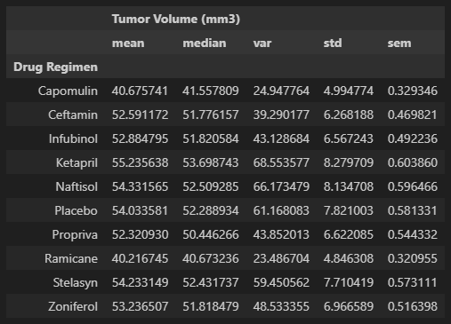
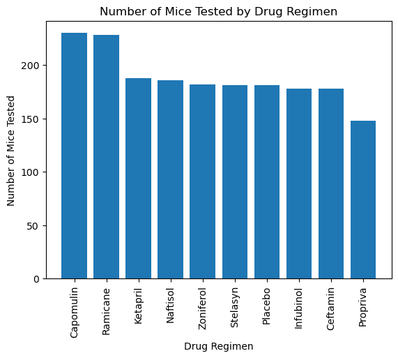
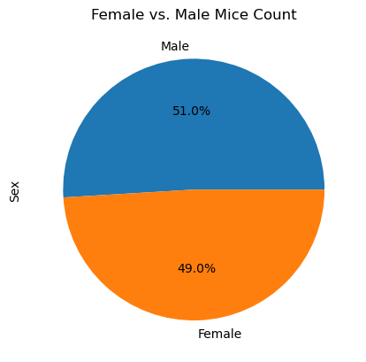
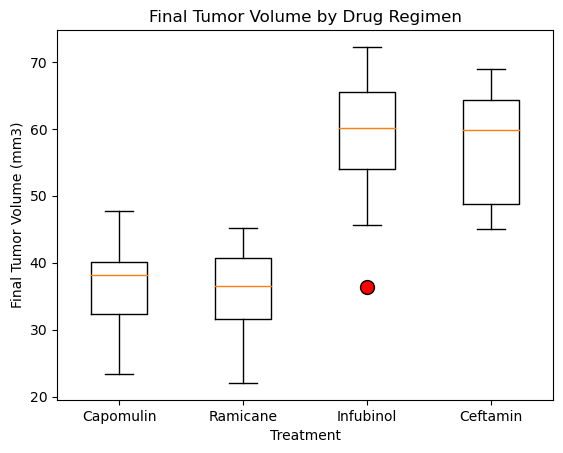
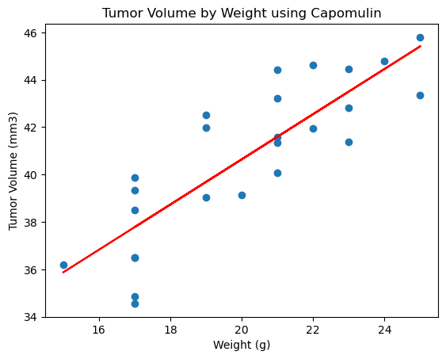

# Analyzing Skin Cancer Treatment Effectiveness
#### Skills Used: Python, Pandas, Matplotlib, SciPy, Statistics
#### Data Source: Generated by Mockaroo, LLC (2022) Realistic Data Generator

# Overview

In this challenge, we analyzed data from Pymaceuticals, Inc., a new pharmaceutical company that specializes in anti-cancer medications, and their potential treatments for skin cancer.

* The study covered 248 mice and measured their tumor volume over 45 days to determine the most promising treatment regimen.

* We first prepared the data by putting it into a dataframe, checking for duplicates, and cleaning the data.

* Then we generated some summary statistics to determine a subset of the most promising treatments, including the mean, median, variance, standard deviation, and SEM for each drug treatment.
    

* We then took a subset of the treatments and further analyzed by creating bar and pie charts, boxplots, and scatter plots and calculated quartiles and outlers for each drug.

    

    

# Conclusions

Based on this dataset, we can draw multiple conclusions on the most promising treatments. 

* Of all the possible treatment regimens, Ramicane had the smallest tumor volume average, median, variance, standard deviation, and SEM, making it one of the most promising treatments in the dataset.

* Of the four most promising drugs (Capomulin, Ramicane, Infubinol, and Ceftamin) there was only one outlier shown in the boxplot. This may imply that we can more comfortably rely on the results of the studies.

    
    
* The correlation coefficient between weight and tumor volume for mice treated with Capomulin is 0.84. Because this is close to 1.0, we can gather that there is a pretty strong positive correlation between the volume of the tumor and the weight of the mouse.

    